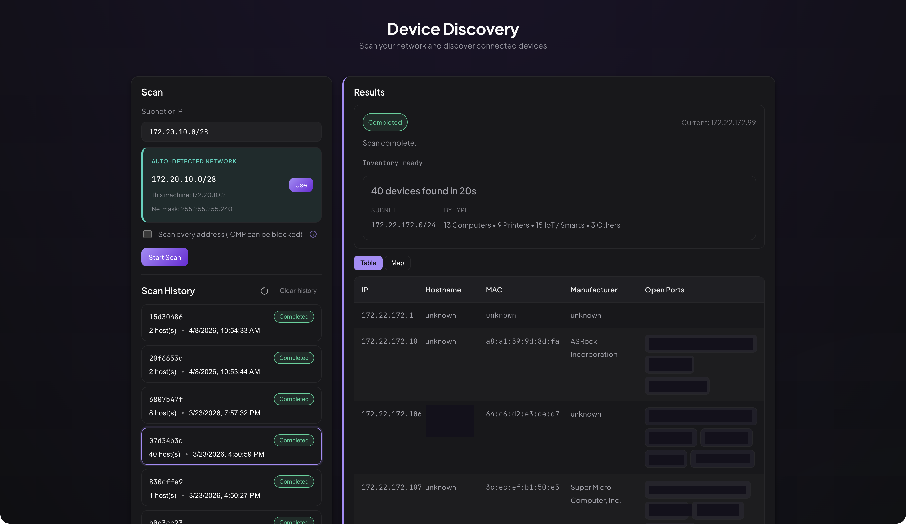

# Device Discovery

Network asset discovery tool: discovers live hosts on a subnet, enriches them with hostname, MAC, manufacturer, and open ports, then outputs a JSON inventory.

A bootleg nmap, if you will.

## Screenshot



**Two ways to use it:**

| Mode       | Description                                                                               |
| ---------- | ----------------------------------------------------------------------------------------- |
| **CLI**    | Run `python3 cli.py`. Writes `inventory_*.json` to disk.                                  |
| **Web UI** | React frontend + FastAPI backend. Start a scan from the browser, view results in a table. |

---

## Quick start

After cloning, `cd` into the repo directory.

### CLI (no server needed)

By default, auto-detects your local subnet — no arguments needed:

```bash
python3 cli.py
```

Optionally specify a subnet with `--subnet` (e.g. to scan a different network, or when auto-detect picks the wrong interface):

```bash
python3 cli.py --subnet 172.22.172.0/24
python3 cli.py --subnet 172.22.172.92    # plain IP, resolved via your local networks
```

- Use `--skip-ping-sweep` if ICMP is blocked on your network. This will attempt to scan every single IP address.
- Run `python3 cli.py --help` for all options.

### Web UI (backend + frontend)

**Terminal 1 — Backend**
```bash
cd web/backend
python3 -m venv .venv
source .venv/bin/activate   # On Windows: .venv\Scripts\activate
pip install -r requirements.txt
uvicorn app.main:app --reload --port 8008
```

**Terminal 2 — Frontend**
```bash
cd web/frontend
npm install
npm run dev
```

Then open **http://localhost:5173** or whatever port Vite decides to use.

---

## Project structure

```
device_discover/
├── cli.py                # CLI entry point
├── __main__.py           # Enables `python -m device_discover`
├── scanner.py            # Core scanning logic (ping sweep, port scan, etc.)
├── networking.py         # Subnet detection, CIDR normalization
└── web/
    ├── backend/          # FastAPI API + scan orchestration
    └── frontend/         # React + Vite UI
```

- **scanner.py** — Used by both CLI and web backend.
- **networking.py** — Used for subnet detection and input normalization.

---

## Docs

- [web/backend/README.md](web/backend/README.md) — Backend setup, uvicorn options, env vars
- [web/frontend/README.md](web/frontend/README.md) — Frontend setup, build, proxy
